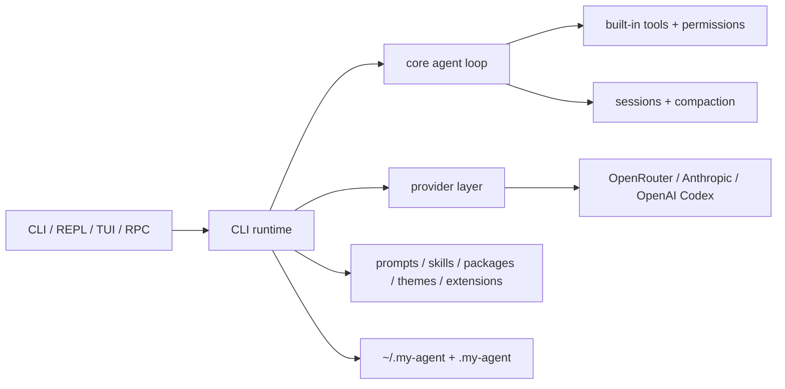

<p align="center">
  
</p>

<p align="center">
  <a href="https://github.com/prkasat/my-agent/actions/workflows/ci.yml"></a>
  
  
</p>

# my-agent

`my-agent` is a private-first terminal AI runtime for coding and task-specific workflows. It pairs a daily-driver CLI/TUI with durable sessions, explicit permission gates, trusted local extensions, reusable resource packages, and provider-aware model selection.

## Why It Exists

- **Private-first workflow:** credentials, sessions, traces, prompts, packages, themes, and extensions live in local `~/.my-agent` and project `.my-agent` directories.
- **One coherent terminal UX:** interactive terminals default to the full-screen TUI, with REPL, one-shot, replay, trace, profile, and JSONL RPC modes available from the same CLI.
- **Provider-aware model routing:** OpenRouter API keys, Anthropic OAuth, and OpenAI Codex OAuth are modeled explicitly so model availability and auth errors stay explainable.
- **Inspectable agent runtime:** the core loop, tools, permissions, sessions, compaction, tracing, and extension contracts are split into focused packages with docs and tests.
- **Extensible by design:** prompts, skills, packages, themes, and trusted local extensions let the agent grow beyond coding-only workflows without rewriting the core.

## Quick Start

Requirements:

- Node.js 22.19.0 or newer
- npm 11 or newer

```bash
npm install
npm run build
npm test
npm run lint
```

Start the agent:

```bash
node packages/cli/dist/main.js
```

Interactive terminals launch the TUI by default. Use `--repl` for the plain-text fallback:

```bash
node packages/cli/dist/main.js --repl
```

## Authentication

```bash
export OPENROUTER_API_KEY=...
node packages/cli/dist/main.js
```

OAuth providers are available from the TUI or REPL:

```text
/login anthropic
/login openai-codex
```

Provider policy:

| Provider | Auth | Notes |
|---|---|---|
| `openrouter` | API key | Supported through `OPENROUTER_API_KEY` or auth storage. |
| `anthropic` | OAuth | Subscription-style provider path. |
| `openai-codex` | OAuth | ChatGPT subscription / Codex path, distinct from generic OpenAI Platform API usage. |

## Common Commands

```bash
node packages/cli/dist/main.js --help
node packages/cli/dist/main.js --doctor
node packages/cli/dist/main.js --list-models
node packages/cli/dist/main.js --safe-mode
node packages/cli/dist/main.js --repl
node packages/cli/dist/main.js --tui
node packages/cli/dist/main.js --trace
node packages/cli/dist/main.js --profile "say hello"
node packages/cli/dist/main.js --replay <file>
node packages/cli/dist/main.js --rpc
npm run eval:mock
```

## Architecture



Workspace packages:

| Package | Owns |
|---|---|
| `packages/ai` | provider adapters, model metadata, streaming helpers, OAuth helper types |
| `packages/core` | agent loop, tools, permissions, sessions, compaction, resources, extension contracts |
| `packages/cli` | settings, auth storage, CLI entrypoints, TUI, REPL, RPC, tracing, replay |

## Resource Model

- prompts → lightweight reusable prompt files
- skills → task-specific prompt workflows with commands/aliases
- packages → bundles of prompts, skills, extensions, and themes
- themes → TUI palette overrides
- extensions → trusted local code for tools, middleware, and deeper integrations

Examples:

- `examples/packages/research-bundle/`
- `examples/extensions/`
- `examples/extensions/starter.mjs`
- `examples/prompts/generate-extension.md`

## Validation

The release gate is:

```bash
npm ci
npm run lint
npm run build
npm test
npm run eval:mock
npm audit --audit-level=moderate
```

CI runs the same build, lint, test, and mock eval checks on Ubuntu, macOS, and Windows.

## Documentation

See `docs/README.md`.

Key docs:

- `docs/quickstart.md`
- `docs/providers.md`
- `docs/settings.md`
- `docs/migrations.md`
- `docs/sessions.md`
- `docs/extensions.md`
- `docs/extensions-api-reference.md`
- `docs/skills.md`
- `docs/packages.md`
- `docs/themes.md`
- `docs/tui.md`
- `docs/ui-state.md`
- `docs/prompt-behavior.md`
- `docs/rpc.md`
- `docs/tracing-replay.md`
- `docs/performance.md`
- `docs/evals.md`
- `docs/failure-injection.md`
- `docs/security.md`
- `docs/architecture.md`

Project operations:

- `CONTRIBUTING.md`
- `SECURITY.md`
- `CHANGELOG.md`
- `LICENSE`

## Contributing

Contributions are welcome. Start with `CONTRIBUTING.md`, then run the validation commands listed above before opening a pull request.

## License

MIT. See `LICENSE`.

## Notes

This codebase is intentionally optimized for inspectability and extension authoring, not for hiding complexity.
