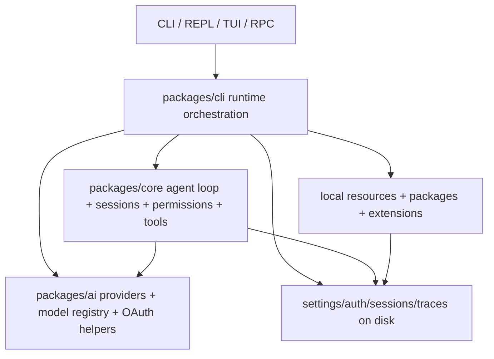
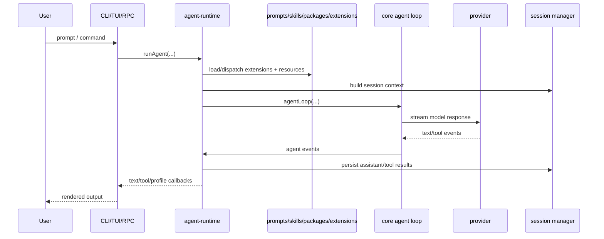
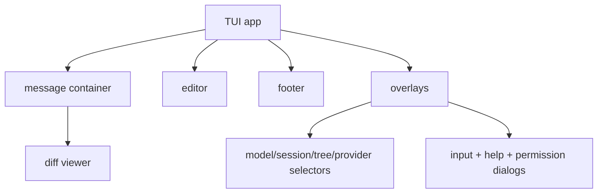

# Architecture

This document is the fastest way to rebuild the mental model for `my-agent` after time away.

## Design goals

- private-first by default
- one coherent auth/model story
- explicit, inspectable runtime boundaries
- strong coding support without hardcoding the product to coding only
- adaptable resource platform: prompts, skills, packages, themes, extensions

## Layer map



## Package boundaries

### `packages/ai`

Owns provider-facing concerns:

- provider registration
- model metadata
- streaming event abstraction
- OAuth provider registry and token refresh helpers

Representative files:

- `packages/ai/src/models.ts`
- `packages/ai/src/providers/index.ts`
- `packages/ai/src/providers/oauth.ts`

### `packages/core`

Owns agent semantics:

- agent loop
- cost tracking
- session persistence + branching + compaction
- permissions
- built-in tools
- extension runner + loader + storage
- resource loaders for prompts/skills/packages

Representative files:

- `packages/core/src/agent/agent-loop.ts`
- `packages/core/src/session/session-manager.ts`
- `packages/core/src/agent/permissions.ts`
- `packages/core/src/extensions/runner.ts`

### `packages/cli`

Owns product/runtime orchestration:

- settings + auth storage
- REPL / one-shot / RPC / TUI entrypoints
- auth-aware model resolution
- tracing / replay
- theme loading
- runtime wiring of sessions, providers, permissions, and extensions

Representative files:

- `packages/cli/src/main.ts`
- `packages/cli/src/runtime/agent-runtime.ts`
- `packages/cli/src/modes/rpc.ts`
- `packages/cli/src/tui/app.ts`

## Single sources of truth

| Concern | Source of truth |
|---|---|
| model definitions | `packages/ai/src/models.ts` |
| auth-aware model visibility | `packages/cli/src/runtime/model-registry.ts` |
| persisted credentials | `packages/cli/src/config/auth-storage.ts` |
| merged settings | `packages/cli/src/config/settings.ts` |
| session format + migration | `packages/core/src/session/*` |
| extension runtime contract | `packages/core/src/extensions/types.ts` + `runner.ts` |

## Request path



## Component map for the TUI shell



## Key runtime composition

The runtime is intentionally thin: it composes existing layers instead of hiding them.

```ts
const result = await runAgent(prompt, {
  cwd,
  settings,
  authStorage,
  session,
  askPermission,
  disableExtensions: safeMode,
  resourceExtensionEntries: resources.packages.flatMap((pkg) => pkg.extensions),
});
```

Inside `runAgent(...)` the important steps are:

```ts
const { key, model } = await resolveConfiguredModel(settings, authStorage);
const projectContext = await discoverProjectContext(cwd, globalDir);
const extensionRuntime = await loadExtensionsForRun(...);
const tools = [...Object.values(createAllTools(cwd)), ...extensionRuntime.runner.getAllTools()];
const systemPrompt = buildSystemPrompt({ baseInstructions, cwd, tools, projectContext, extensionContext });
const eventStream = agentLoop([userMessage], context, loopConfig, { signal });
```

## Why this split exists

### Why auth lives in CLI, not core

Auth is a product concern:

- credentials live in user-local files
- OAuth login/logout belongs to the app shell
- model visibility depends on current auth state

Core should not know where credentials came from; it only asks for `getApiKey(provider)`.

### Why sessions live in core, not CLI

Sessions are part of agent semantics:

- the agent loop depends on persisted history
- compaction and branch summaries are session-format behaviors
- replay/export/recovery all depend on the same durable representation

### Why extensions straddle core and CLI

- core owns the contract and lifecycle engine
- CLI decides discovery paths, trust model, and app-level adapters

## Data that crosses package boundaries

| From | To | Payload |
|---|---|---|
| CLI config | runtime | settings, auth storage, session, resource paths |
| runtime | core | tools, system prompt, session context, permission hooks |
| core | runtime | agent events: text, tool start/end, turn end, agent end |
| runtime | UI | streamed text, tool rows, profiles, errors |
| resources | runtime/core | prompts, skills, themes, extension entries |

## Inspectability features

The repo intentionally exposes the important seams:

- `--trace` writes structured JSONL traces
- `--replay` replays traces or sessions without calling providers
- `--profile` prints runtime timing + cost summaries
- docs point to the exact source files that own each subsystem

## Related docs

- `lifecycle.md`
- `ui-state.md`
- `prompt-behavior.md`
- `tracing-replay.md`
- `playbooks.md`
