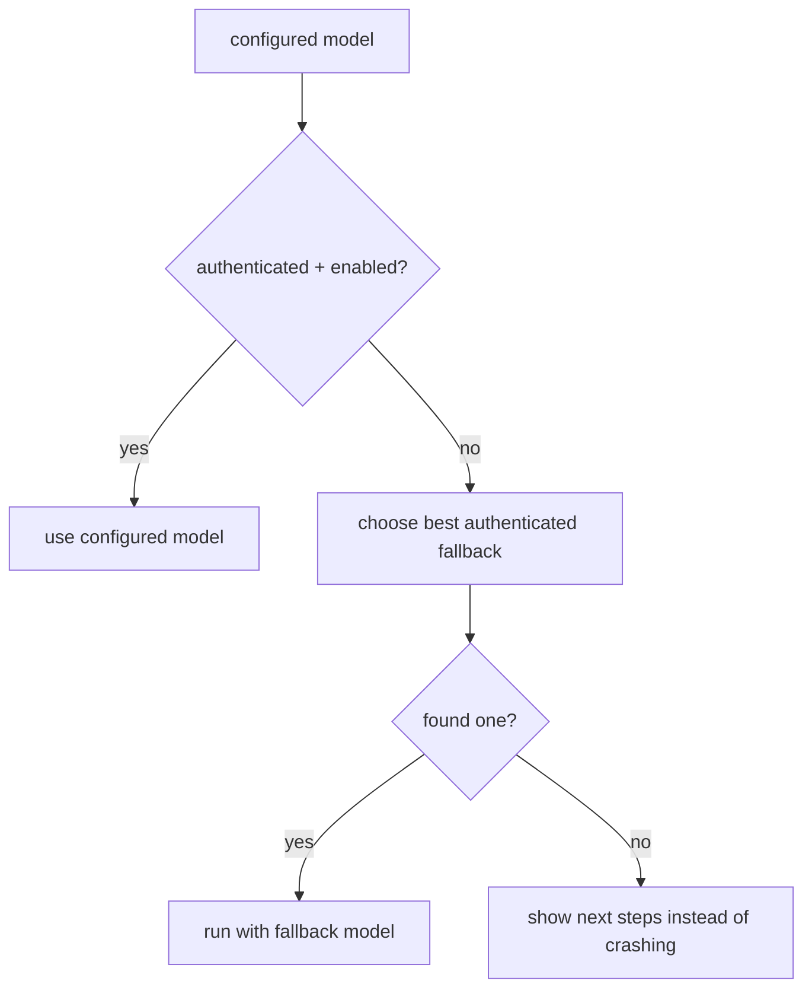

# Capability Matrix and Fallback Policy

## Built-in models

| Model | Provider | Auth | Tools | Streaming | Images | Thinking | Context | Rate-limit profile | Notes / quirks |
|---|---|---|---|---|---|---|---:|---|---|
| `openrouter-auto` | openrouter | api_key | yes | yes | provider-dependent | yes | 200k | moderate | default bootstrap model |
| `qwen3.6-plus` | openrouter | api_key | yes | yes | provider-dependent | yes | 1M | moderate | very large context |
| `trinity-large` | openrouter | api_key | yes | yes | provider-dependent | no | 131k | moderate | no thinking support |
| `claude-sonnet-4` | anthropic | oauth | yes | yes | yes | yes | 200k | subscription-bound | balanced Claude option |
| `claude-opus-4` | anthropic | oauth | yes | yes | yes | yes | 200k | tighter + expensive | highest-cost Claude option |
| `claude-haiku-3.5` | anthropic | oauth | yes | yes | yes | no | 200k | looser | lower-cost Claude option |
| `gpt-5.1-codex` | openai-codex | oauth | yes | yes | provider-dependent | yes | 200k | subscription-bound | ChatGPT/Codex path |
| `gpt-5.1-codex-mini` | openai-codex | oauth | yes | yes | provider-dependent | yes | 200k | subscription-bound | smaller Codex option |

## Fallback policy

## Fallback semantics

### Configured model disappears or becomes unavailable

- registry explains why
- runtime picks the best authenticated fallback when available
- otherwise startup shows onboarding and next steps

### Provider loses auth mid-session

- API key resolution / refresh path fails clearly
- `--list-models` and `--doctor` surface the new availability state

### Stream fails mid-turn

- retryable failures re-enter the retry path with backoff
- non-retryable failures surface a clear error instead of silently pretending success
- aborted runs still preserve structurally valid session state

### Model lacks reasoning support

- `thinkingLevel` is still configured centrally
- provider/model capability differences are documented here
- the runtime does not invent unsupported reasoning features

### Tool-less model fallback

The built-in curated models all support tools. If a future model lacks tool use, the capability matrix and docs must be updated before making it selectable by default.
