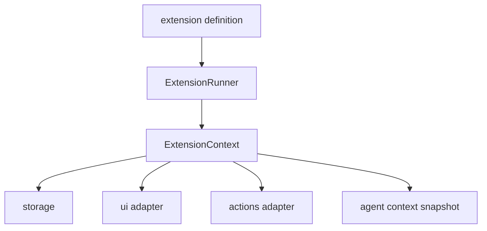

# Extension API Reference

An extension exports a default `ExtensionDefinition`.

## Minimal extension

```js
export default {
  metadata: {
    id: "my-extension",
    name: "My Extension",
    version: "1.0.0",
    apiVersion: "^1.0.0"
  },
  activate(ctx) {
    // register handlers, commands, tools, middleware
  }
}
```

## Component view



## `metadata`

Common fields:

```js
metadata: {
  id: "git-tools",
  name: "Git Tools",
  version: "1.0.0",
  apiVersion: "^1.0.0",
  description: "Helpful git workflows",
  requires: ["other-extension"],
  hotReloadable: true,
  failureMode: "continue"
}
```

## `ctx` surface

### Registration APIs

- `ctx.on(event, handler)`
- `ctx.onAny(handler)`
- `ctx.registerCommand(command)`
- `ctx.registerTool(tool)`
- `ctx.use(middleware)`

### Host surfaces

- `ctx.storage`
- `ctx.ui`
- `ctx.actions`
- `ctx.metrics`
- `ctx.recorder`
- `ctx.getAgentContext()`
- `ctx.signal`
- `ctx.log`

## High-value events

- `session_start`
- `session_end`
- `turn_start`
- `turn_end`
- `message_start`
- `message_update`
- `message_end`
- `tool_execution_start`
- `tool_execution_end`
- `user_input`

## Tool interception

For `tool_execution_start`, return one of:

```js
{ action: "allow" }
{ action: "allow", modifiedArgs }
{ action: "block", reason: "..." }
```

Example:

```js
ctx.on("tool_execution_start", (event) => {
  if (event.toolName === "bash") {
    return { action: "block", reason: "bash disabled in this workflow" };
  }
});
```

## Command pattern

When a slash command should become an agent prompt, use `ctx.actions.sendMessage(...)`.

```js
ctx.registerCommand({
  name: "research",
  async execute(args, ctx) {
    ctx.actions.sendMessage(`Research this topic deeply: ${args}`);
  }
});
```

## Tool pattern

```js
import { Type } from "@sinclair/typebox";

ctx.registerTool({
  name: "echo_ext",
  description: "Echo a value",
  parameters: Type.Object({ value: Type.String() }),
  async execute(_id, params) {
    return { content: [{ type: "text", text: params.value }] };
  }
});
```

## Middleware pattern

```js
ctx.use(async (toolCtx, next) => {
  ctx.log.info(`tool -> ${toolCtx.tool.name}`);
  return await next(toolCtx.args);
});
```

## Config schema pattern

```js
import { Type } from "@sinclair/typebox";

export default {
  metadata: { id: "demo", name: "Demo", version: "1.0.0", apiVersion: "^1.0.0" },
  config: {
    schema: Type.Object({ label: Type.String() }),
    defaults: { label: "demo" }
  },
  activate(ctx) {
    ctx.log.info(ctx.config.label);
  }
};
```

## Error handling

- incompatible API versions are skipped before activation
- activation failures are downgraded into warnings by the CLI runtime path
- event/middleware failures obey the extension's `failureMode`

## Best practices

- keep `activate()` small
- start command-only, then add tools, then middleware
- prefer explicit `apiVersion`
- use tracing while authoring
- document any required local dependencies clearly

## Starter prompt + template

- `examples/prompts/generate-extension.md`
- `examples/extensions/starter.mjs`
