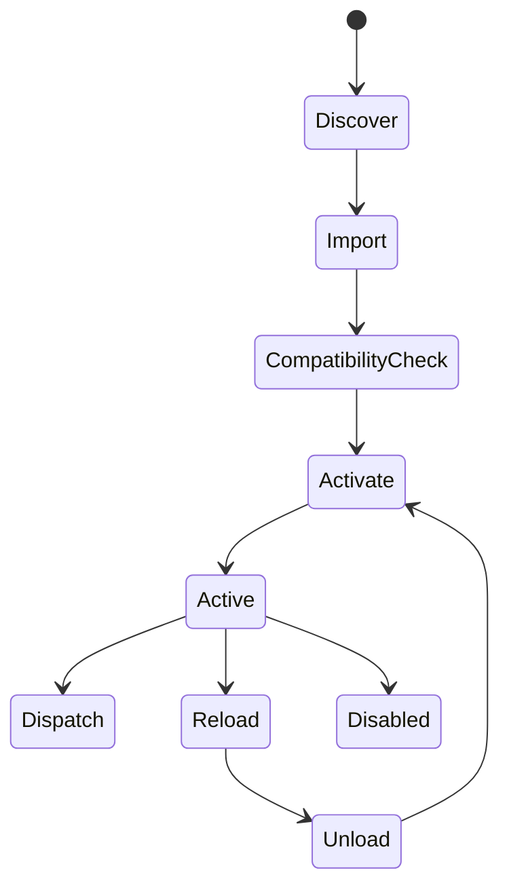

# Extensions

Extensions are trusted local modules that run in-process.

## Trust model

- private-first
- local and trusted
- no marketplace assumptions in v1
- no sandbox boundary today

If you load an extension, it has host-process privileges.

## Discovery

Extensions are loaded from:

- `settings.extensions`
- `.my-agent/extensions/`
- `~/.my-agent/extensions/`
- package-provided extension entries

## Runtime lifecycle



## Supported capabilities

- register tools
- register slash commands
- intercept / modify tool arguments
- block tool calls
- observe session / turn / message / tool lifecycle events
- use session/global extension storage
- participate in hot reload through the core loader API
- surface select/confirm/input/notify UI through the TUI adapter

## Compatibility checks

Extensions may declare:

```js
metadata: {
  apiVersion: "^1.0.0"
}
```

If an extension declares an incompatible API version, the host skips it with a warning instead of crashing the run.

## Failure behavior

By default, broken extensions are skipped with warnings so the app can continue running.

This is especially important for:

- first-run resilience
- safe-mode debugging
- incremental extension authoring

## Safe mode

```bash
node packages/cli/dist/main.js --safe-mode
```

This bypasses package extension entries and extension loading for the current run.

## Visibility in the app

`/extensions` now shows:

- configured extension paths
- loaded extension commands
- loaded extension tools
- any extension warnings

## Recommended starter

See:

- `examples/extensions/starter.mjs`
- `examples/extensions/command-only.mjs`
- `examples/extensions/tool-only.mjs`
- `examples/extensions/middleware-example.mjs`
- `examples/extensions/non-coding-workflow.mjs`

## Hot-reload development workflow

1. build the repo
2. point `settings.extensions` at your local extension
3. use the core loader API or restart the CLI/TUI while iterating
4. keep the extension small until the command/tool contract is stable

## Debugging tips

- start with `--safe-mode` to isolate extension effects
- use `--trace` to capture runtime + extension events
- prefer tiny command-only prototypes before deeper middleware/tool hooks
- validate config schema errors early

## Config validation

If an extension exposes a TypeBox config schema, the runner validates user config before activation.

## API reference

See `docs/extensions-api-reference.md` for the host contract.
