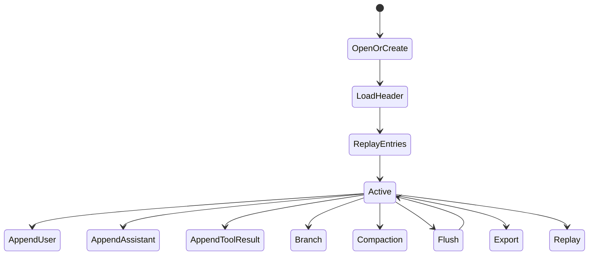
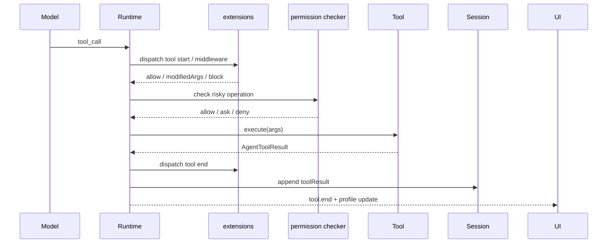
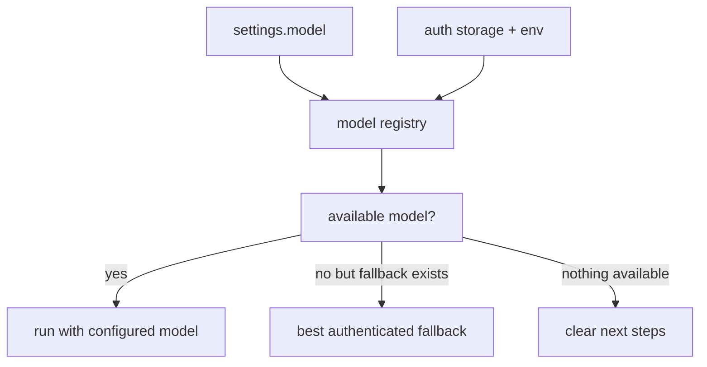
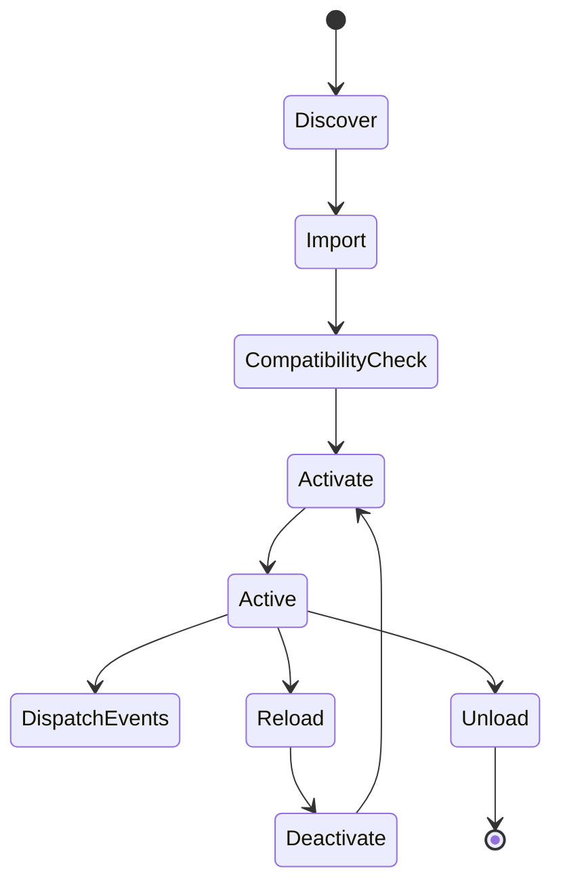
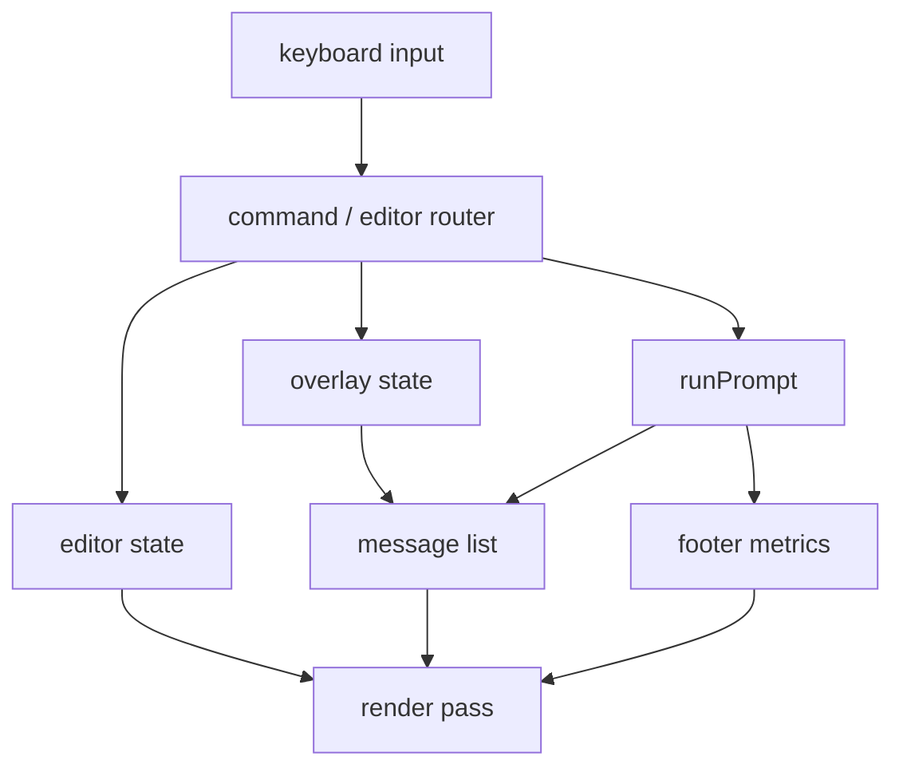

# Lifecycle Walkthroughs

This document traces the major lifecycles step by step.

## 1. Agent turn lifecycle

```mermaid
sequenceDiagram
    participant UI as CLI/TUI/RPC
    participant Runtime as runAgent
    participant Session
    participant Ext as extension runner
    participant Loop as agentLoop
    participant Provider

    UI->>Runtime: prompt
    Runtime->>Session: buildSessionContext()
    Runtime->>Ext: load + activate
    Runtime->>Loop: agentLoop(...)
    Loop->>Provider: stream request
    Provider-->>Loop: text/tool events
    Loop-->>Runtime: AgentEvent stream
    Runtime->>Session: append assistant/tool results
    Runtime->>Ext: dispatch lifecycle events
    Runtime-->>UI: text/tool/profile callbacks
    Runtime->>Session: flush()
```

Detailed order:

1. resolve the configured model against current auth state
2. discover project context (`SYSTEM.md`, `APPEND_SYSTEM.md`, repo instruction files)
3. load trusted extensions for the run
4. let extensions transform user input
5. build the tool list
6. build the system prompt
7. build session context from durable history
8. append the new user message
9. enter the core agent loop
10. stream assistant text/tool activity
11. persist assistant messages and tool results
12. flush the session even on error or abort
13. return a runtime profile containing timings, costs, tool durations, and compactions

## 2. Session lifecycle



Important details:

- sessions are append-only JSONL logs
- malformed trailing lines are skipped for crash recovery
- newer unsupported schema versions are rejected loudly
- branch summaries and compaction summaries are persisted as explicit entries
- branch pointer changes are in-memory until a new append or summary write occurs

Key code path:

```ts
const sessionContext = session.buildSessionContext();
session.appendMessage(userMessage);
session.appendMessage(assistantMessage);
session.flush();
```

## 3. Tool execution lifecycle



Important invariants:

- extension middleware can modify args, but they are revalidated
- risky operations go through permissions
- cancelled tool results are still persisted so the session remains structurally valid
- tool result `details` stay out of the model transcript but remain available to UI/debugging

## 4. Permission lifecycle

1. the model requests a tool call
2. extensions may modify or block it
3. the permission checker classifies the tool:
   - read-only
   - risky (`bash`, `edit`, `write`, etc.)
4. mode decides behavior:
   - `ask`
   - `auto`
   - `strict` → mapped to deny at runtime
5. when `ask` is active:
   - REPL prompts in stderr/stdin
   - TUI shows a selector overlay
   - RPC denies because there is no interactive approval surface
6. result is traced and, if allowed, the tool runs

## 5. Auth + model lifecycle



Runtime behavior:

```ts
const { key, model, availableModels } = await resolveConfiguredModel(settings, authStorage);
const apiKey = await authStorage.resolveApiKey(model.provider);
```

## 6. Extension lifecycle



Important behaviors:

- discovery comes from settings, project/global directories, and packages
- invalid or incompatible extensions are skipped with warnings by default
- activation can register tools, commands, middleware, and event handlers
- unload fires an abort signal so background work can stop cooperatively
- hot reload is supported by the core loader API for development flows

## 7. TUI render/update/input lifecycle



Runtime-driven UI updates:

- `onText` appends streaming assistant tokens
- `onToolStart` adds a tool row
- `onToolEnd` updates duration/output and may attach a diff viewer
- `onTurnEnd` updates token/cost totals in the footer

## 8. RPC lifecycle

1. host sends JSONL command
2. server validates it
3. server acknowledges `prompt` immediately
4. prompt execution emits structured events:
   - `prompt.started`
   - `prompt.text`
   - `prompt.thinking`
   - `tool.start`
   - `tool.end`
   - `prompt.completed`
5. `abort` cancels the active controller
6. `getState` and `listModels` are side-effect-free

## Related docs

- `architecture.md`
- `ui-state.md`
- `tracing-replay.md`
- `sessions.md`
- `extensions.md`
