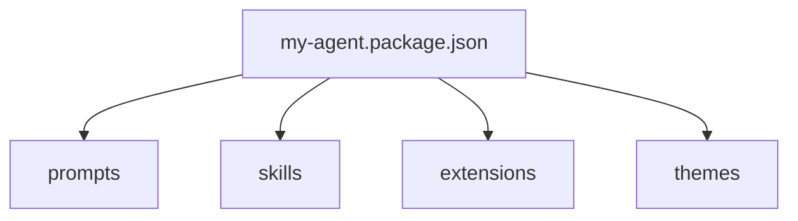

# Packages

Packages bundle reusable resources together.

## Mental model



## Manifest

Use `my-agent.package.json`:

```json
{
  "name": "research-bundle",
  "description": "Example non-coding workflow bundle",
  "prompts": ["prompts"],
  "skills": ["skills"],
  "extensions": ["extensions/research-capture.mjs"],
  "themes": ["themes/research-dark.json"]
}
```

## Discovery

Packages are discovered from:

- `settings.packages`
- `.my-agent/packages/`
- `~/.my-agent/packages/`

## Failure handling

Package load failures are downgraded into warnings where possible.
Broken packages should not prevent the whole CLI from starting.

## REPL / TUI visibility

- `/packages`
- package-provided extensions participate in runtime loading unless `--safe-mode` is enabled

## Example

See `examples/packages/research-bundle/`.
