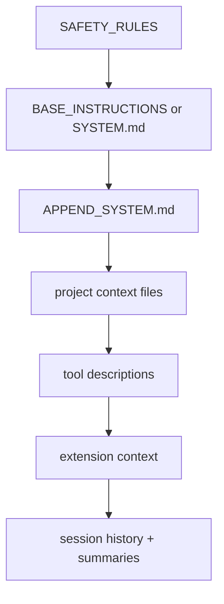

# Prompt and Behavioral Architecture

This document explains where behavior comes from: prompt, runtime, tools, model, or extensions.

## Prompt assembly order



The system prompt is assembled in two layers:

1. core prompt composition via `buildSystemPrompt(...)`
2. conversation context via session history and summaries

## What comes from code vs prompts

| Behavior source | Examples |
|---|---|
| prompt text | general agent behavior, repo-specific instructions, task framing |
| runtime code | auth/model resolution, retries, permissions, extension loading |
| tool code | filesystem/shell validation, truncation, path safety |
| model behavior | final wording, planning style, tool-use choice |
| extension behavior | custom tools, commands, middleware, prompt injections |

## Key code path

```ts
let baseInstructions = projectContext.systemOverride ?? BASE_INSTRUCTIONS;
if (projectContext.systemAppend) {
  baseInstructions = `${baseInstructions}\n\n${projectContext.systemAppend}`;
}

const systemPrompt = buildSystemPrompt({
  baseInstructions,
  cwd,
  tools,
  projectContext: projectContext.projectContext,
  extensionContext,
});
```

## Prompt sources

### Base instructions

- global product behavior
- coding defaults
- safety posture

### Project context

Discovered from repo-local instruction files and treated as lower-privilege context than the built-in safety rules.

### Templates and skills

- templates: direct prompt expansion for reusable invocations
- skills: task-specific prompt workflows with arguments and aliases

### Extensions

Extensions can:

- transform user input before it reaches the runtime
- add tool descriptions to the model-visible tool list
- inject contextual hints into the system prompt via runtime extension context

### Session history and summaries

History is not raw forever:

- branch summaries compress abandoned branches
- compaction summaries compress long history
- both are explicit durable messages, not hidden mutable caches

## Safety assumptions encoded in prompts

The prompt layer reinforces, but does not replace, runtime safeguards.

Examples:

- avoid introducing vulnerabilities
- prefer safe changes over destructive ones
- follow project instructions unless they conflict with higher-level safety

Runtime still enforces:

- permissions
- tool/path validation
- auth requirements
- provider selection

## Example: changing behavior safely

Before changing prompt architecture:

1. update `docs/prompt-behavior.md`
2. add or update eval tasks
3. run `npm run eval:mock`
4. inspect traces/replay for representative sessions
5. compare before/after transcripts for regressions

## Example: a skill-driven prompt path

```md
---
description: Research a topic deeply
command: research
aliases: investigate, brief
---
Research this topic deeply: $@
```

Invoking `/research database failover` changes behavior without changing core runtime code.

## Prompt regression control

Prompt-affecting changes should be validated with:

- `evals/tasks/*`
- `--trace`
- `--replay`
- docs/examples updates when the user-facing behavior shifts
