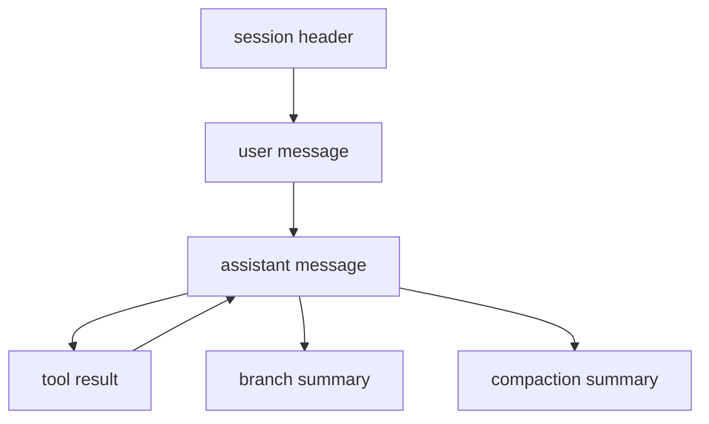

# Sessions, Branching, Tree, and Export

Sessions are append-only JSONL logs.

## Where they live

```text
~/.my-agent/sessions/<encoded-cwd>/
```

## Core properties

- durable append-only format
- resumable across restarts
- tolerant of malformed trailing lines from interrupted writes
- explicit branching and summaries
- export to standalone HTML
- replayable for debugging

## Session shape at a glance



## REPL flows

### Continue recent session

Default behavior when starting the CLI in a repo.

### List sessions

```text
/sessions
```

### Fork into a new session file

```text
/branch
```

### Inspect the current tree

```text
/tree
```

### Change active branch context inside the current session

```text
/tree switch <entry-id>
```

This points the current leaf at another entry so the next prompt continues from that branch context.

### Export

```text
/export
/export my-session.html
```

## TUI flows

- session selector overlay for switching session files
- tree selector overlay for switching branch context inside the current session
- diff viewer blocks for edit-like tool results

## Recovery model

- malformed trailing JSONL lines are skipped during load
- invalid headers are treated as corruption and surfaced clearly
- future-version session files are rejected loudly instead of being misread
- write failures are covered by rollback-focused session tests

## Replay

```bash
node packages/cli/dist/main.js --replay path/to/session.jsonl
```

Replay is read-only and safe for post-mortem inspection.

## Import / migration strategy

v1 focuses on durable export + replay rather than general import.

Current strategy:

- keep session schema versioned
- prefer forward migrations for older files
- reject unsupported future files clearly
- treat replay as the canonical debugging/inspection path

See `migrations.md` for the format-evolution rules.
