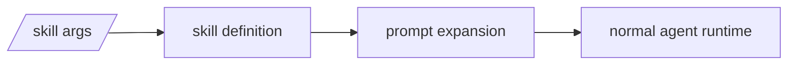

# Skills

Skills are lightweight task-specific prompt resources.

They are intentionally simpler than extensions.

## Mental model



## What a skill defines

- command name
- description
- prompt body
- optional aliases

## Discovery

Skills load from:

- `.my-agent/skills/`
- `~/.my-agent/skills/`
- `settings.skills`
- package-provided skill directories

## Formats

### Markdown with frontmatter

```md
---
description: Research a topic deeply
command: research
aliases: investigate, brief
---
Research this topic: $@
```

### JSON

```json
{
  "name": "Research",
  "description": "Research a topic deeply",
  "command": "research",
  "aliases": ["investigate", "brief"],
  "prompt": "Research this topic: $@"
}
```

## Arguments

Supported substitutions:

- `$1`
- `$2`
- `$@`
- `$ARGUMENTS`
- `${@:N}`
- `${@:N:L}`

## REPL / TUI usage

- `/skills`
- `/<skill-name> ...`

## Example

See `examples/packages/research-bundle/skills/research.md`.
