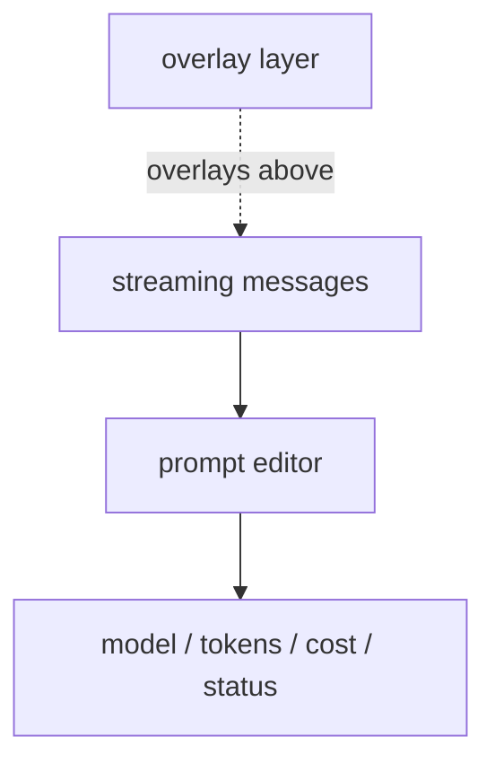
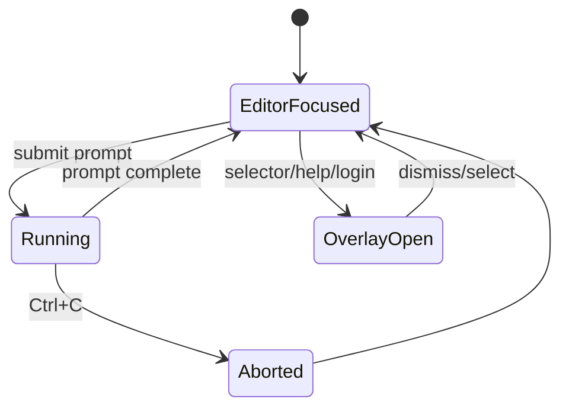

# TUI Shell

Start it with:

```bash
node packages/cli/dist/main.js --tui
```

`--tui` requires an interactive TTY.

## Screen layout



## Current flows

- prompt entry with a full-screen editor
- streaming assistant output
- tool execution rows with args, durations, and output
- diff viewer blocks for edit-like tool results
- permission approval overlay
- model selector overlay
- session selector overlay
- tree selector overlay for branch-context switching
- provider login selector overlay
- help overlay

## Slash commands inside the TUI

- `/help`
- `/login [provider]`
- `/model [name]`
- `/sessions`
- `/tree`
- `/theme [name]`
- `/skills`
- `/packages`
- `/extensions`
- `/quit`

## State transitions



## Runtime wiring

The TUI reuses the same underlying runtime as the CLI/REPL:

```ts
const result = await runAgent(prompt, {
  cwd,
  settings,
  authStorage,
  session,
  askPermission,
  resourceExtensionEntries,
}, {
  onText,
  onToolStart,
  onToolEnd,
  onTurnEnd,
});
```

That means the TUI inherits:

- the same model registry
- the same auth storage
- the same session persistence
- the same extension loading rules
- the same permission checks

## Footer metrics

The footer updates from runtime profile data:

- input tokens
- output tokens
- total cost
- current model
- safe-mode / thinking status

## Notes

- Ctrl+C aborts the active run, cancels an in-flight login, or exits when idle
- login progress is streamed into the message pane during OAuth flows
- theme selection persists through the normal settings path
- diff blocks are rendered inline for edit-like tool results
- branch context can be switched from the tree selector without leaving the TUI

## Related docs

- `ui-state.md`
- `architecture.md`
- `lifecycle.md`
