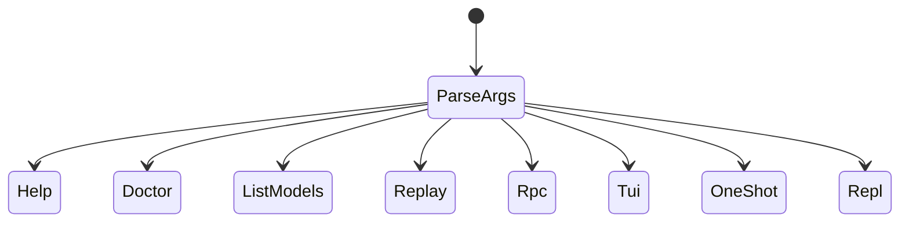
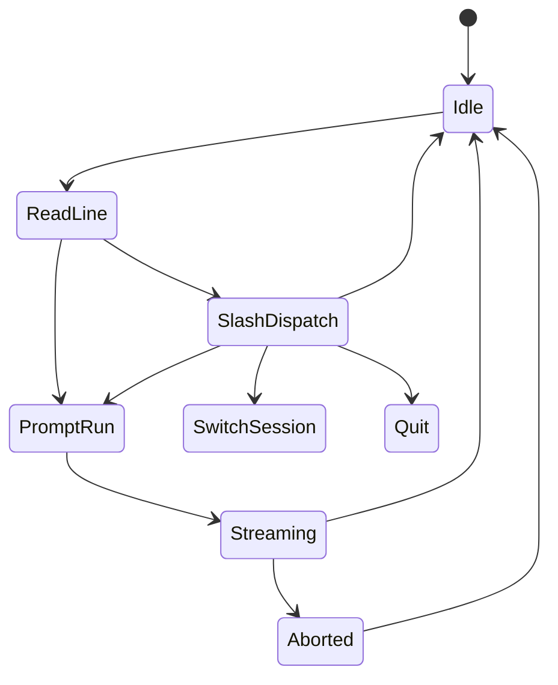
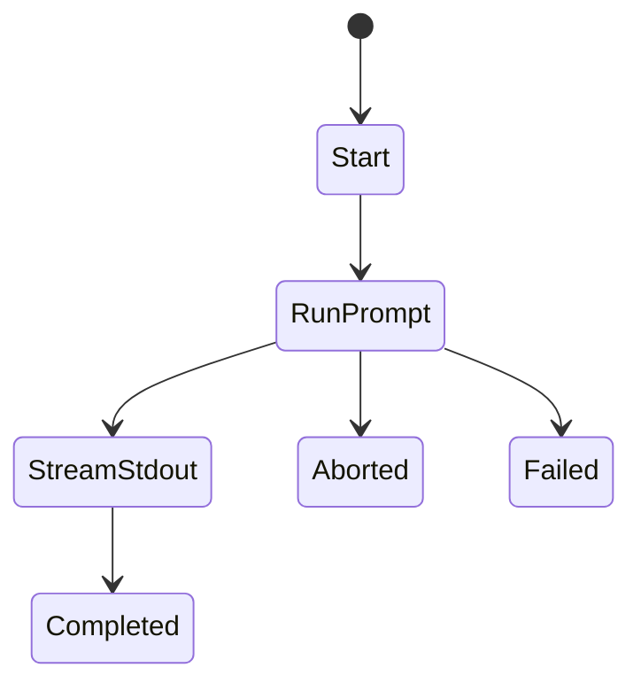
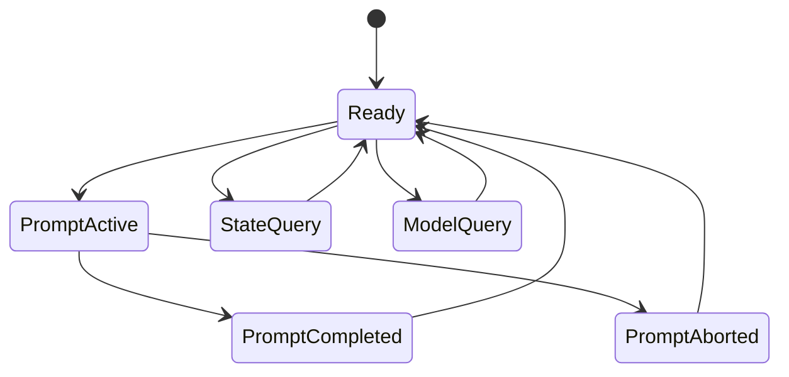
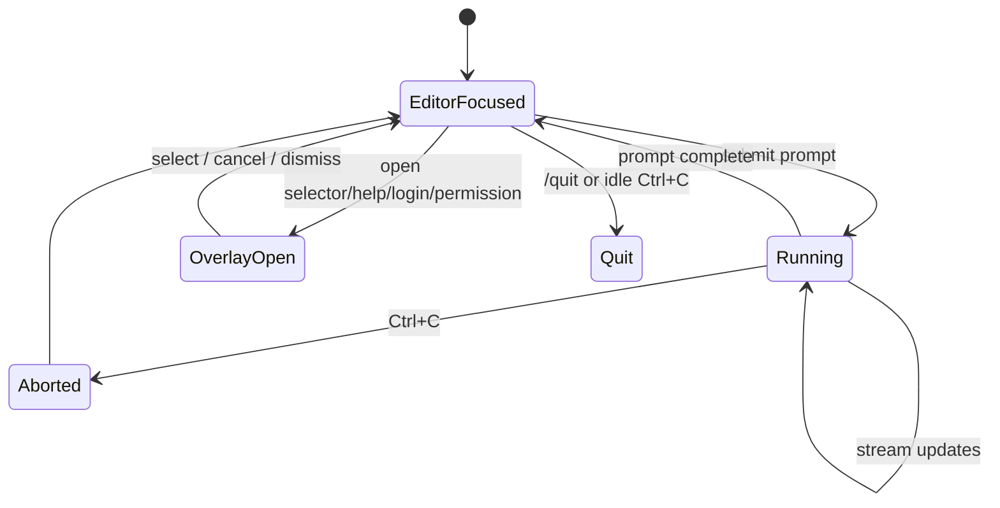
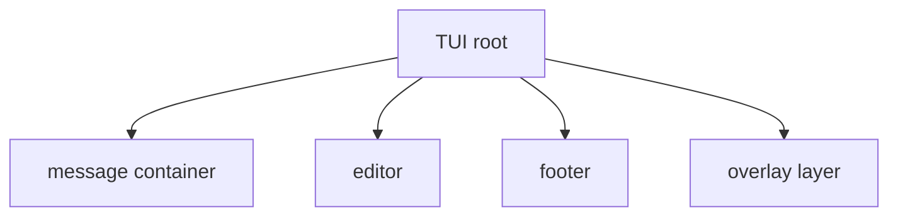
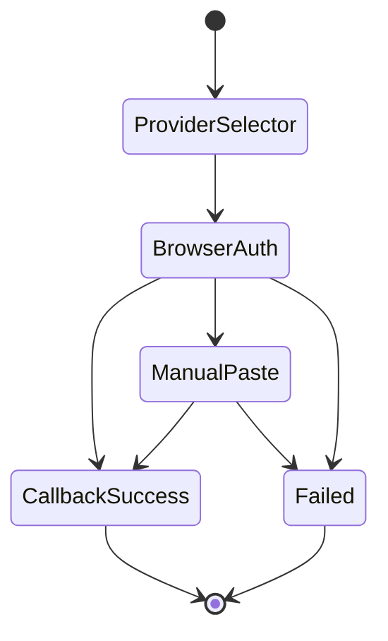
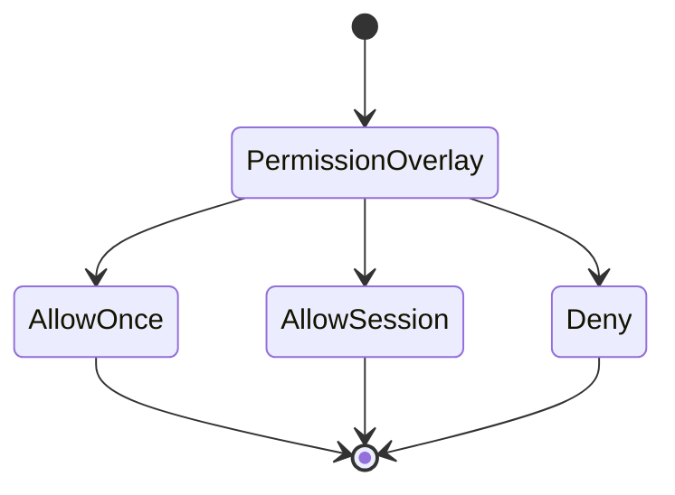
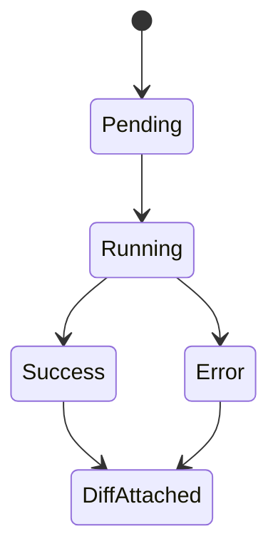
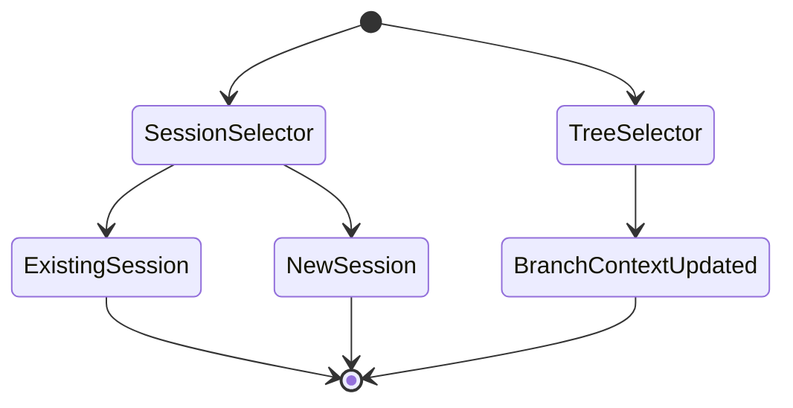

# CLI / TUI State Model

This document makes the app shell understandable without reading the whole implementation.

## CLI execution modes



## REPL input lifecycle



Implementation sketch:

```ts
const result = await handleSlashCommand(line, ctx);
if (!result) {
  await runPrompt(line, abortSignal);
  return;
}
```

## One-shot lifecycle



Behavioral notes:

- assistant text goes to `stdout`
- tool progress and errors go to `stderr`
- `--profile` prints timing/cost summary to `stderr`
- Ctrl+C aborts with exit code `130`

## RPC lifecycle



## TUI top-level state



## TUI component tree



## Overlay / modal lifecycle

All overlays in the current TUI follow the same pattern:

1. build overlay component
2. call `tui.showOverlay(...)`
3. move focus into the overlay
4. on select/cancel:
   - hide overlay
   - restore focus to editor
   - apply the result or dismiss

Representative snippet:

```ts
const list = new SelectList(items, items.length, theme.selectList);
const handle = tui.showOverlay(list, { anchor: "center", width: "70%", maxHeight: 18 });
list.onCancel = () => {
  handle.hide();
  tui.setFocus(editor);
};
```

## Login-flow UI states



## Permission-prompt UI states



## Tool-execution UI states



Notes:

- tool rows now capture args, durations, and textual output
- edit-like tool results can attach a diff viewer below the tool row
- footer token/cost totals update on turn end

## Session / branch-switch UI states



## Abort behavior

- REPL one-shot: Ctrl+C aborts the active run, then returns to prompt or exits if idle
- TUI: Ctrl+C aborts the active run; when idle it exits the app
- RPC: `abort` cancels the active controller for the request id

## Learning checklist for maintainers

If you understand the items below, you understand the app shell:

- how a line becomes a slash command vs a model prompt
- where overlays are created and dismissed
- how runtime callbacks update messages/footer state
- how session switching differs from branch-context switching
- how `--trace` and `--profile` expose app behavior
