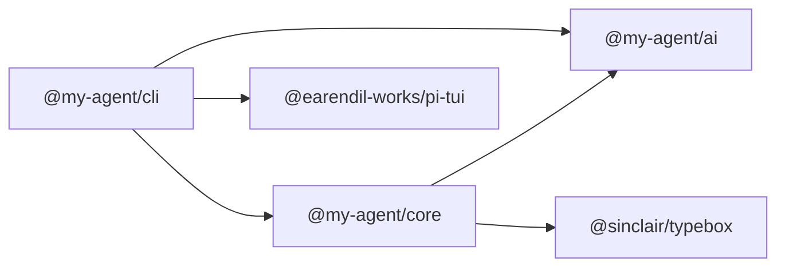
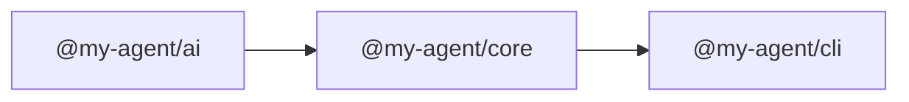

# Workspace Packages

`my-agent` is split into three TypeScript workspaces. The split keeps provider protocol code, agent semantics, and product/UI orchestration independently testable.



| Package | Role | Local README |
|---|---|---|
| `@my-agent/ai` | Provider registry, model metadata, streaming primitives, OAuth helpers | [`ai/README.md`](ai/README.md) |
| `@my-agent/core` | Agent loop, tools, permissions, sessions, resources, extensions | [`core/README.md`](core/README.md) |
| `@my-agent/cli` | CLI/TUI/RPC product shell, settings, auth storage, tracing, replay | [`cli/README.md`](cli/README.md) |

## Build Order



The root build command encodes this order:

```bash
npm run build
```

## Validation

Use the root validation commands so package references and TypeScript project references are checked together:

```bash
npm run lint
npm run build
npm test
npm run eval:mock
```

