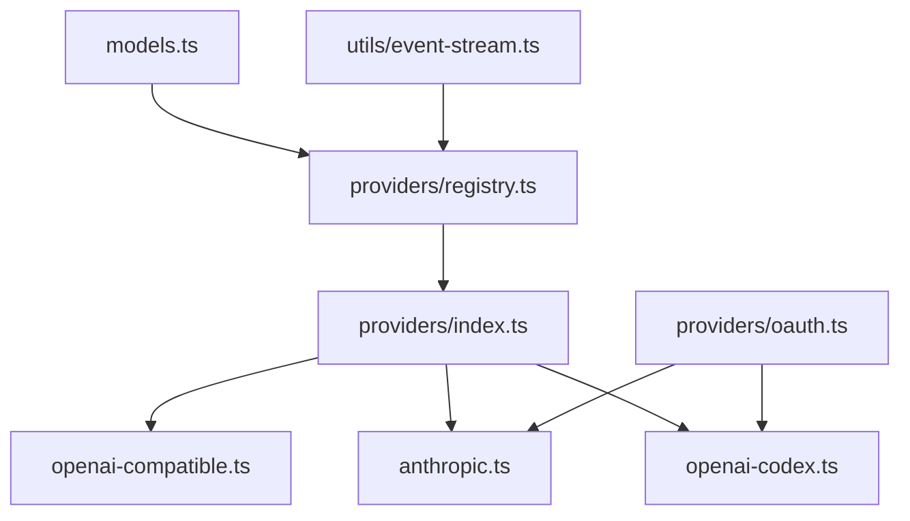
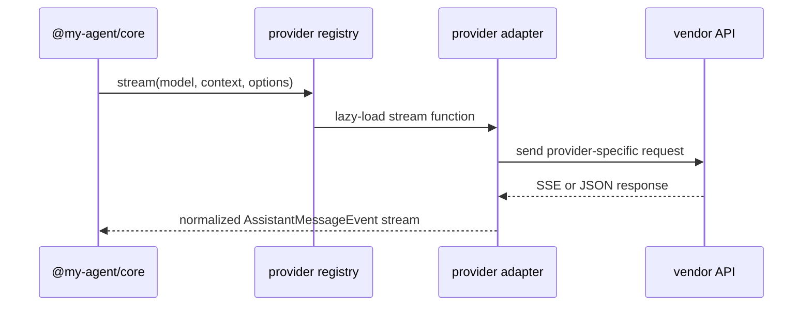

# @my-agent/ai

Provider-facing LLM abstraction for `my-agent`. This package owns model metadata, provider registration, streaming event normalization, retry helpers, and OAuth provider helpers.

## Public Surface

The package exports from [`src/index.ts`](src/index.ts):

- model helpers: `models`, `getModel`, `getModelsByProvider`, `normalizeModelKey`, `calculateCost`
- provider registry: `registerProvider`, `getProvider`, `stream`, `complete`
- built-in stream factories for Anthropic, OpenAI-compatible APIs, OpenAI Codex, and mocks
- OAuth provider registration and refresh helpers
- provider-agnostic message, tool, usage, stream, and model types
- `EventStream` and retry helpers

## Source Areas

| Area | Owns |
|---|---|
| [`src/providers/`](src/providers/README.md) | Built-in provider adapters, lazy provider registry, OAuth flows |
| [`src/utils/`](src/utils/README.md) | Streaming and retry utilities shared by providers |
| [`src/models.ts`](src/models.ts) | Explicit model registry and cost metadata |
| [`src/types.ts`](src/types.ts) | Provider-neutral messages, tools, usage, context, and stream events |

## Provider Contract

Providers must emit the normalized events defined in [`src/types.ts`](src/types.ts), preserve usage data when available, honor abort signals, and avoid owning product-level credential storage. Credential lookup happens in `@my-agent/cli`; this package only accepts `StreamOptions.apiKey`.

## Tests

Provider behavior is covered by package-local tests in [`test/`](test/), including Anthropic streaming, OpenAI-compatible usage and reasoning payloads, OAuth helpers, retry behavior, and stream errors.

