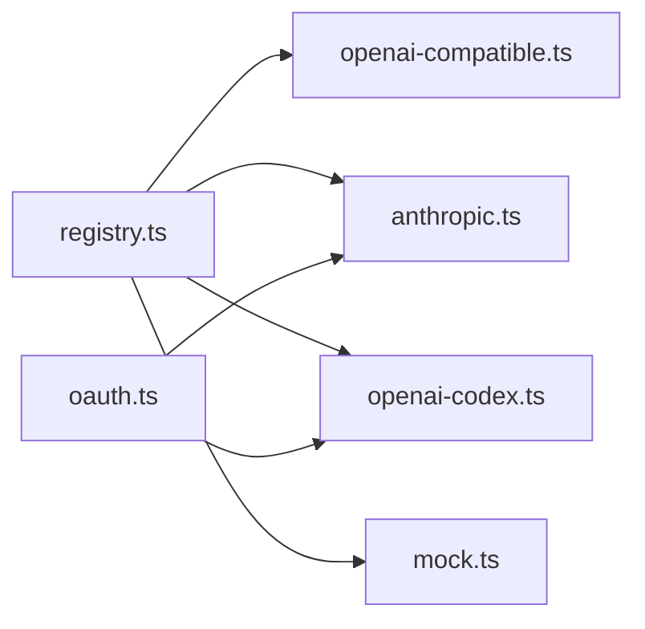

# AI Providers

Provider adapters translate vendor-specific APIs into the `AssistantMessageEvent` stream used by `@my-agent/core`.

## Files

| File | Purpose |
|---|---|
| [`registry.ts`](registry.ts) | Lazy provider factory registry plus `stream` and `complete` helpers |
| [`index.ts`](index.ts) | Registers built-in providers on import |
| [`openai-compatible.ts`](openai-compatible.ts) | OpenAI-compatible chat/completions streaming, used by OpenRouter |
| [`anthropic.ts`](anthropic.ts) | Anthropic Messages API streaming, thinking blocks, tool calls, usage |
| [`openai-codex.ts`](openai-codex.ts) | OpenAI Codex/ChatGPT subscription provider path |
| [`oauth.ts`](oauth.ts) | OAuth provider registry, device/manual flows, token refresh helpers |
| [`mock.ts`](mock.ts) | Deterministic test provider |

## Rules

- Keep provider modules free of CLI storage assumptions.
- Return normalized events only; do not leak raw vendor response shapes across the package boundary.
- Honor `StreamOptions.signal`.
- Preserve provider usage and real-cost metadata when the upstream API supplies it.

