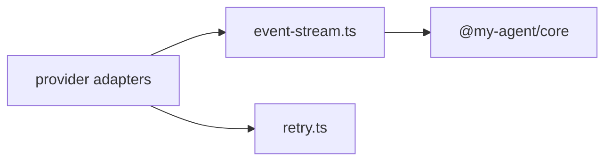

# AI Utilities

Small provider support utilities shared by the AI package.

| File | Purpose |
|---|---|
| [`event-stream.ts`](event-stream.ts) | Async event collector with final-result resolution for streaming providers |
| [`retry.ts`](retry.ts) | Retry classification and bounded retry wrapper for transient provider failures |

Use these helpers inside provider adapters; callers outside `@my-agent/ai` should normally use the package exports from [`../../README.md`](../../README.md).

