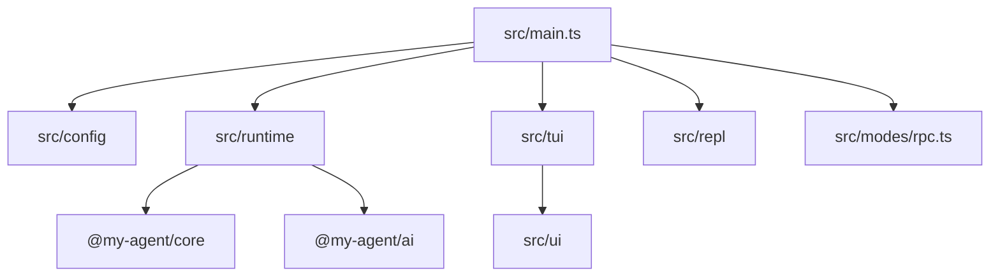
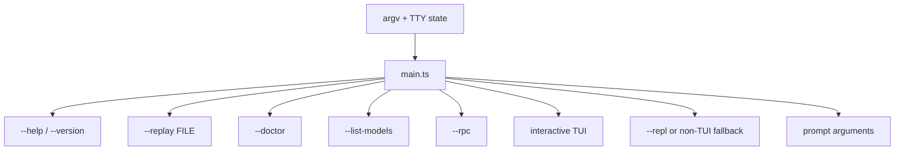

# @my-agent/cli

Product shell for `my-agent`. This package turns the AI and core libraries into a runnable CLI, TUI, REPL, replay tool, and JSONL RPC server.



## Entrypoints

- `bin.my-agent`: `dist/main.js` after build
- source entry: [`src/main.ts`](src/main.ts)
- package `main` and `types`: `dist/main.js` and `dist/main.d.ts`

## Source Areas

| Area | Owns |
|---|---|
| [`src/commands/`](src/commands/README.md) | Standalone command helpers such as login, replay, and export |
| [`src/config/`](src/config/README.md) | Settings and credential storage |
| [`src/modes/`](src/modes/README.md) | Non-default runtime modes, currently JSONL RPC |
| [`src/repl/`](src/repl/README.md) | Plain-text REPL and slash command handling |
| [`src/runtime/`](src/runtime/README.md) | Runtime composition, model resolution, extension loading, tracing |
| [`src/startup/`](src/startup/README.md) | Startup UI-mode selection |
| [`src/tui/`](src/tui/README.md) | Full-screen terminal app orchestration |
| [`src/ui/`](src/ui/README.md) | TUI components, themes, selectors, keybindings |

## Mode Selection



## Validation

Run package behavior through the root checks:

```bash
npm run lint
npm run build
npm test
```
