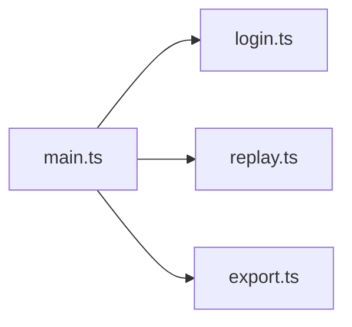

# CLI Commands

Command helpers used by `src/main.ts`, the REPL, or the TUI.

| File | Purpose |
|---|---|
| [`login.ts`](login.ts) | OAuth login command plumbing |
| [`replay.ts`](replay.ts) | Renders trace/session timelines without provider calls |
| [`export.ts`](export.ts) | Exports a session to standalone HTML |

