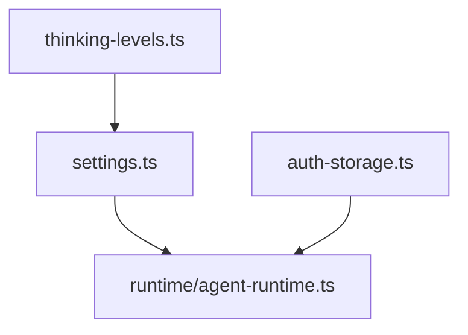

# CLI Config

Local product configuration and credential storage.

| File | Purpose |
|---|---|
| [`settings.ts`](settings.ts) | Merges user and project settings, writes project settings |
| [`auth-storage.ts`](auth-storage.ts) | Stores API keys and OAuth credentials in `~/.my-agent/auth.json` with mode `0600` |
| [`thinking-levels.ts`](thinking-levels.ts) | Maps CLI/user thinking levels to provider settings |

Do not move credential persistence into `@my-agent/core`; core receives API keys through callbacks only.

