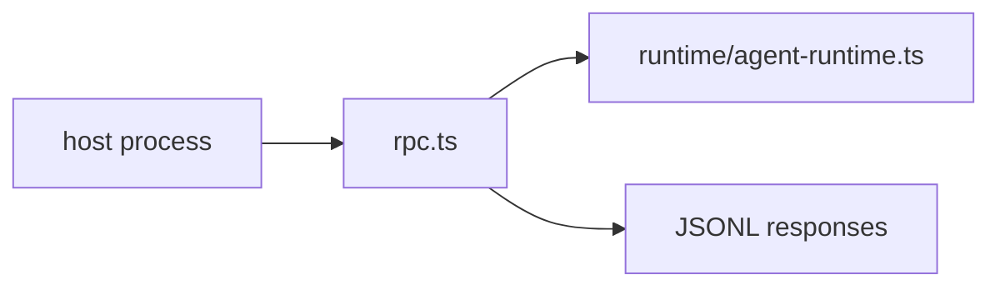

# CLI Modes

Non-default CLI modes.

| File | Purpose |
|---|---|
| [`rpc.ts`](rpc.ts) | JSONL stdin/stdout server for host-process integrations |

The default interactive modes live in [`../tui/`](../tui/README.md) and [`../repl/`](../repl/README.md).

