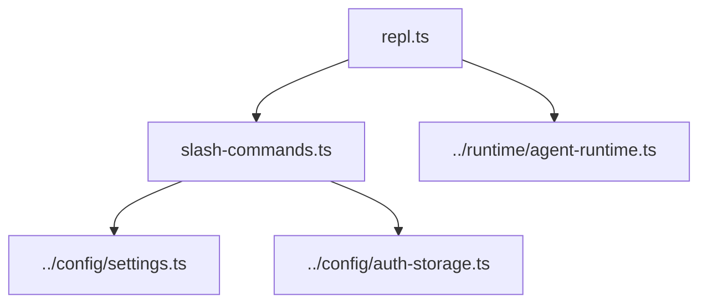

# CLI REPL

Plain-text interactive fallback for terminals where the full TUI is not desired or not available.

| File | Purpose |
|---|---|
| [`repl.ts`](repl.ts) | Readline loop, agent invocation, text/tool rendering |
| [`slash-commands.ts`](slash-commands.ts) | `/help`, `/model`, `/login`, resource commands, and settings mutations |

