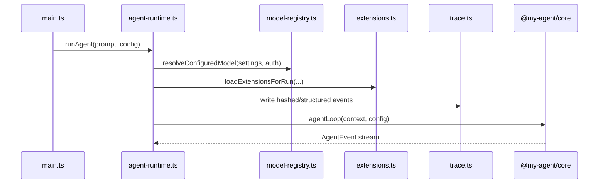

# CLI Runtime

Runtime composition layer. It wires settings, auth, resources, tools, extensions, sessions, tracing, and provider streams into one `runAgent(...)` call.

| File | Purpose |
|---|---|
| [`agent-runtime.ts`](agent-runtime.ts) | Main runtime orchestration and profiling |
| [`model-registry.ts`](model-registry.ts) | Auth-aware model availability and resolution |
| [`extensions.ts`](extensions.ts) | CLI-side extension discovery and UI adapter wiring |
| [`trace.ts`](trace.ts) | Structured JSONL tracing with redaction |

