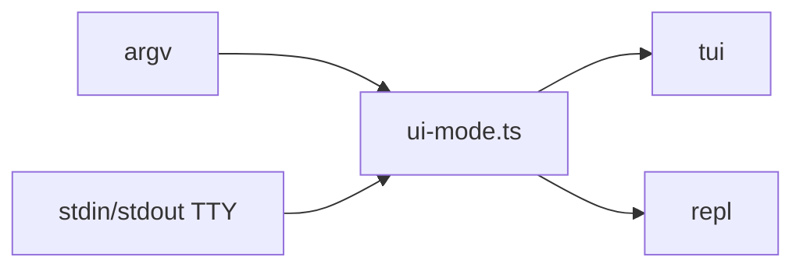

# CLI Startup

Startup mode selection helpers.

```mermaid
flowchart LR
    Args["argv"] --> Mode["ui-mode.ts"]
    TTY["stdin/stdout TTY"] --> Mode
    Mode --> TUI["tui"]
    Mode --> REPL["repl"]
```

| File | Purpose |
|---|---|
| [`ui-mode.ts`](ui-mode.ts) | Chooses TUI vs REPL fallback from flags and TTY state |

