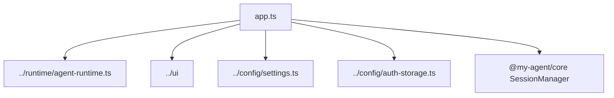

# CLI TUI

Full-screen terminal app orchestration.

| File | Purpose |
|---|---|
| [`app.ts`](app.ts) | TUI state machine, overlays, permission prompts, model/session/theme/resource workflows |

Reusable visual components live in [`../ui/`](../ui/README.md).

