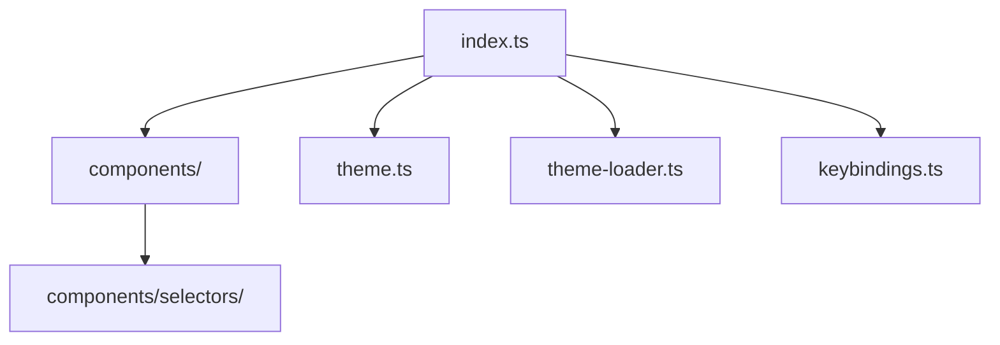

# CLI UI

Reusable TUI components and theme primitives built on `@earendil-works/pi-tui`.

## Files

| File | Purpose |
|---|---|
| [`index.ts`](index.ts) | Re-exports pi-tui primitives and my-agent UI components |
| [`theme.ts`](theme.ts) | Default agent theme and theme factory |
| [`theme-loader.ts`](theme-loader.ts) | Loads user/project/package themes |
| [`keybindings.ts`](keybindings.ts) | Agent action keybinding registry |

## Components

| Component | Purpose |
|---|---|
| [`components/`](components/README.md) | Shared renderable pieces for messages, tools, selectors, footer, and diffs |
| [`components/streaming-message.ts`](components/streaming-message.ts) | Streaming assistant message rendering |
| [`components/user-message.ts`](components/user-message.ts) | User message rendering |
| [`components/system-message.ts`](components/system-message.ts) | System/status message rendering |
| [`components/tool-execution.ts`](components/tool-execution.ts) | Tool execution rows and details |
| [`components/footer.ts`](components/footer.ts) | Mode/model/cost/status footer |
| [`components/diff-viewer.ts`](components/diff-viewer.ts) | Diff and multi-diff rendering |
| [`components/selectors/`](components/selectors/) | Model, session, and tree selectors |
