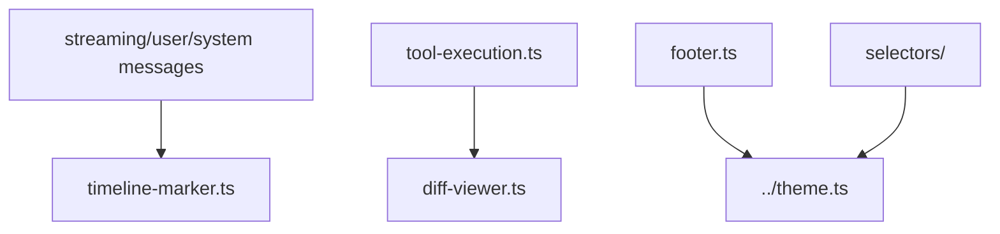

# CLI UI Components

Renderable pieces used by the full-screen TUI.

| File or directory | Purpose |
|---|---|
| [`streaming-message.ts`](streaming-message.ts) | Incremental assistant text rendering |
| [`user-message.ts`](user-message.ts) | User prompt rendering |
| [`system-message.ts`](system-message.ts) | Startup, warning, and status messages |
| [`tool-execution.ts`](tool-execution.ts) | Tool call status, arguments, and result summaries |
| [`footer.ts`](footer.ts) | Mode, model, token, cost, and status footer |
| [`diff-viewer.ts`](diff-viewer.ts) | Single and multi-file diff rendering |
| [`timeline-marker.ts`](timeline-marker.ts) | Conversation timeline separators |
| [`panel.ts`](panel.ts) | Shared panel framing helper |
| [`selectors/`](selectors/README.md) | Model, session, and tree selection overlays |

