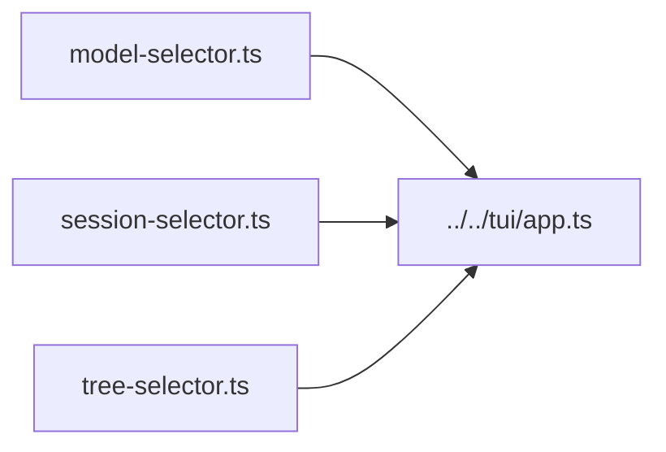

# CLI UI Selectors

Overlay selectors for model, session, and session-tree navigation.

| File | Purpose |
|---|---|
| [`model-selector.ts`](model-selector.ts) | Auth-aware model choices and model metadata display |
| [`session-selector.ts`](session-selector.ts) | Existing session list and selection result types |
| [`tree-selector.ts`](tree-selector.ts) | Session tree navigation component and helper |

