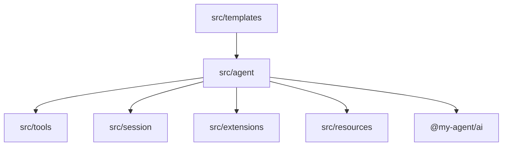
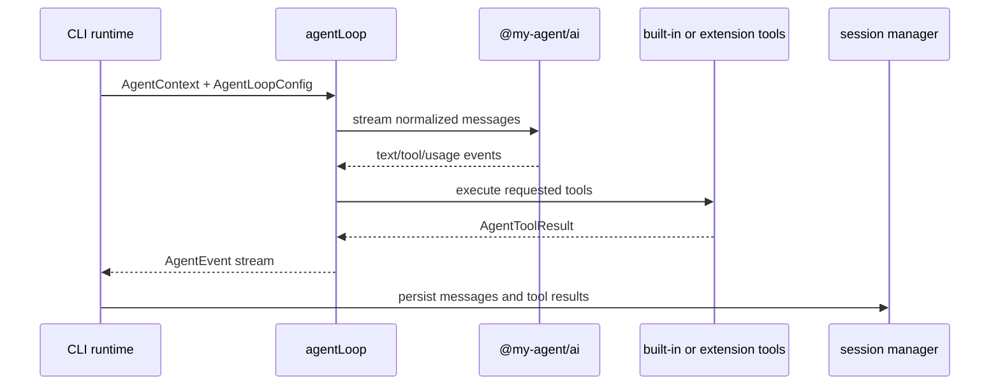

# @my-agent/core

Agent runtime engine. This package owns agent semantics: the loop, tools, permissions, sessions, compaction, resource loading, extension contracts, and low-level utilities.

## Public Surface

[`src/index.ts`](src/index.ts) exports the supported core API:

- agent loop and conversion helpers
- permission checker and base system prompt builder
- extension loader, runner, storage, metrics, mocks, and type contracts
- resource package and skill loaders
- session manager, compaction, branch summaries, and session types
- prompt template loading and expansion
- built-in tool definitions, tool registry, shell helpers, redaction, audit logging, and file-locking utilities

## Source Areas

| Area | Owns |
|---|---|
| [`src/agent/`](src/agent/README.md) | Agent loop, permissions, system prompt, resource discovery, cost tracking |
| [`src/extensions/`](src/extensions/README.md) | Trusted in-process extension API and runtime |
| [`src/resources/`](src/resources/README.md) | Resource package and skill discovery/loading |
| [`src/session/`](src/session/README.md) | Durable session files, branches, compaction, summaries, migrations |
| [`src/templates/`](src/templates/README.md) | Prompt template discovery and expansion |
| [`src/tools/`](src/tools/README.md) | Built-in read/write/edit/bash/search tools and supporting utilities |

## Agent Loop Shape

## Security Notes

Core enforces permission checks, protected-path detection, secret redaction for audit logs, output sanitization, and cross-process file mutation locks. Product credential storage lives in `@my-agent/cli`.

## Tests

Package tests live in [`test/`](test/) and cover the agent loop, permissions, sessions, compaction, tools, extensions, resources, templates, and regression cases for file mutation locking.

