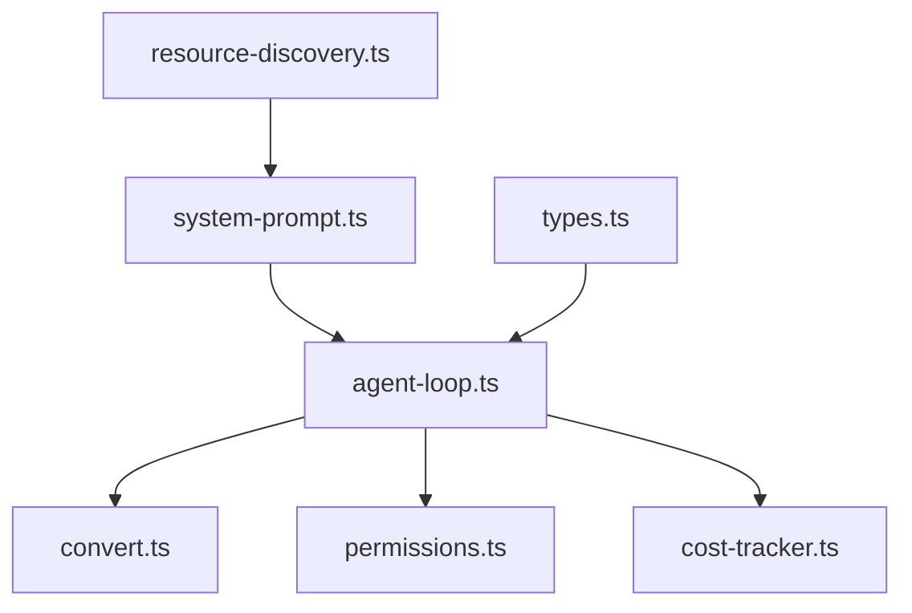

# Core Agent

Agent semantics for `@my-agent/core`.

| File | Purpose |
|---|---|
| [`agent-loop.ts`](agent-loop.ts) | Turn loop, model streaming, tool execution, retries, cost recording |
| [`convert.ts`](convert.ts) | Converts internal agent messages to provider-neutral LLM messages |
| [`cost-tracker.ts`](cost-tracker.ts) | Session cost accounting, including resumed usage |
| [`custom-messages.ts`](custom-messages.ts) | Internal non-LLM message types and conversions |
| [`permissions.ts`](permissions.ts) | Tool permission policy, protected path checks, path-sensitive argument scanning |
| [`resource-discovery.ts`](resource-discovery.ts) | Project context file discovery for system prompts |
| [`system-prompt.ts`](system-prompt.ts) | Base instructions, safety rules, and prompt assembly |
| [`types.ts`](types.ts) | Agent context, tool contract, loop config, hooks, and events |

The agent layer depends on `@my-agent/ai` types and stream functions but does not know how credentials are stored.

