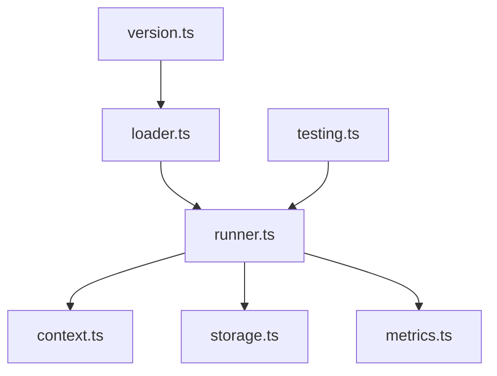

# Core Extensions

Trusted in-process extension runtime. Extensions can observe lifecycle events, add or intercept tools, transform user input, store extension state, and surface UI prompts through adapters.

| File | Purpose |
|---|---|
| [`types.ts`](types.ts) | Extension manifests, events, handlers, middleware, UI, storage, metrics, actions |
| [`loader.ts`](loader.ts) | Loads extension modules and validates compatibility |
| [`runner.ts`](runner.ts) | Dispatches events, middleware, tool interception, and result modification |
| [`context.ts`](context.ts) | Builds the context object passed to extensions |
| [`storage.ts`](storage.ts) | Memory and file-backed extension storage |
| [`metrics.ts`](metrics.ts) | Tracks extension token/API/time/error counters |
| [`testing.ts`](testing.ts) | Test helpers for extension authors and core tests |
| [`version.ts`](version.ts) | Extension API compatibility gate |

Extensions are trusted local code. They are not sandboxed; use `--safe-mode` in the CLI to bypass extension loading.

