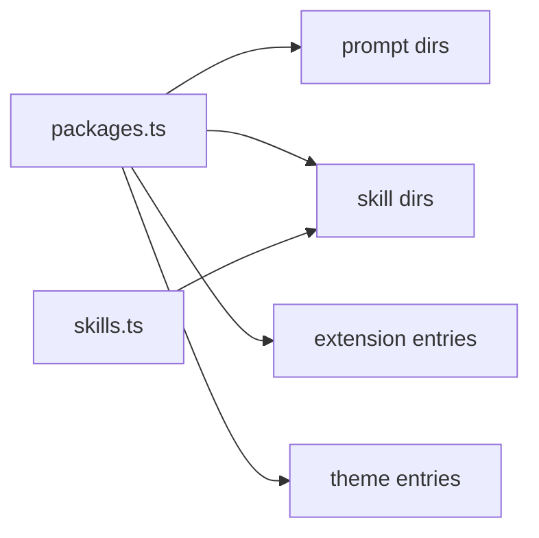

# Core Resources

Resource discovery for reusable local assets.

| File | Purpose |
|---|---|
| [`packages.ts`](packages.ts) | Loads package manifests and resolves bundled prompts, skills, extensions, and themes |
| [`skills.ts`](skills.ts) | Loads skill definitions, command aliases, help text, and prompt expansion |

`@my-agent/cli` decides which resource directories to pass in from settings and package manifests. Core owns parsing and expansion.

