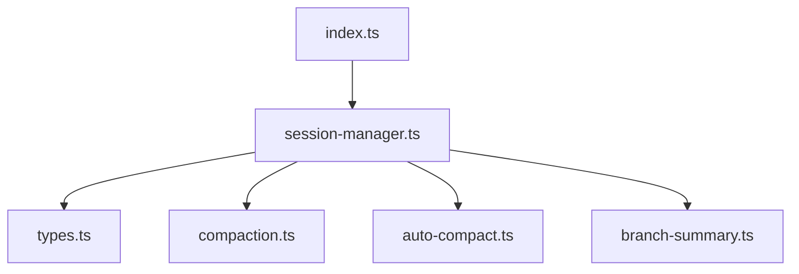

# Core Sessions

Durable session persistence, tree navigation, compaction, and summaries.

| File | Purpose |
|---|---|
| [`session-manager.ts`](session-manager.ts) | JSONL session storage, branch/tree operations, migration handling, context building |
| [`types.ts`](types.ts) | Session headers, entries, tree nodes, context, info records |
| [`compaction.ts`](compaction.ts) | Context measurement, compaction planning, LLM-powered summaries |
| [`auto-compact.ts`](auto-compact.ts) | Runtime auto-compaction orchestration and persistence hooks |
| [`branch-summary.ts`](branch-summary.ts) | Branch summary generation and extraction helpers |
| [`index.ts`](index.ts) | Session exports used by `@my-agent/core` consumers |

Session files are local user data and can contain prompt/tool output. Treat them as sensitive even when trace and audit logs redact known secret shapes.

