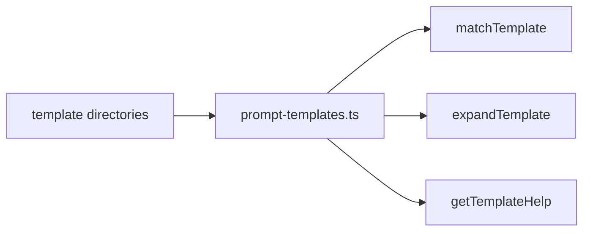

# Core Templates

Prompt template loading and expansion.

| File | Purpose |
|---|---|
| [`prompt-templates.ts`](prompt-templates.ts) | Loads Markdown prompt templates, matches invocations, expands arguments, and renders help |

Templates are lightweight prompt snippets. Skills handle heavier repeatable workflows.

