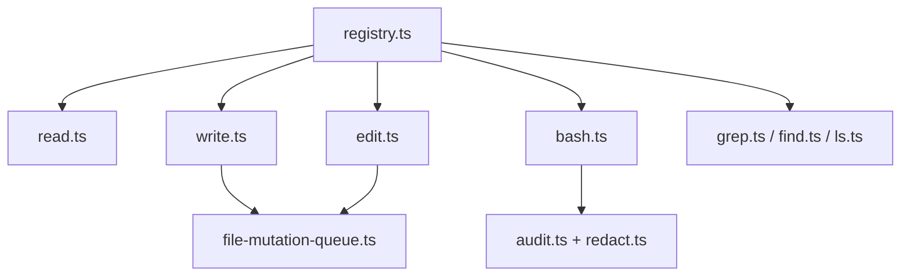

# Core Tools

Built-in tools and supporting utilities for agent file, shell, search, and image operations.

## Tool Definitions

| File | Purpose |
|---|---|
| [`registry.ts`](registry.ts) | Assembles read-only, coding, and all-tool sets |
| [`tool-definition.ts`](tool-definition.ts) | Bridges tool definitions and agent tool contracts |
| [`read.ts`](read.ts), [`write.ts`](write.ts), [`edit.ts`](edit.ts) | File read and mutation tools |
| [`bash.ts`](bash.ts), [`bash-executor.ts`](bash-executor.ts) | Bash tool and standalone executor |
| [`grep.ts`](grep.ts), [`find.ts`](find.ts), [`ls.ts`](ls.ts) | Search and listing tools |
| [`image-resize.ts`](image-resize.ts) | Image resizing helpers for tool output |

## Safety Utilities

| File | Purpose |
|---|---|
| [`path-utils.ts`](path-utils.ts) | CWD boundary checks and path resolution |
| [`file-mutation-queue.ts`](file-mutation-queue.ts) | Cross-process file locks for write/edit safety |
| [`audit.ts`](audit.ts), [`redact.ts`](redact.ts) | Audit log redaction and structured logging |
| [`sanitize-output.ts`](sanitize-output.ts) | Terminal output cleanup and env-sensitive redaction |
| [`process-cleanup.ts`](process-cleanup.ts) | Timeout and child-process cleanup helpers |
| [`temp-file-manager.ts`](temp-file-manager.ts) | Temp output lifecycle for large tool results |
| [`truncate.ts`](truncate.ts) | Shared truncation and formatting limits |
| [`shell-utils.ts`](shell-utils.ts) | Shell discovery and environment setup |
| [`tools-manager.ts`](tools-manager.ts) | External helper tool installation paths |

